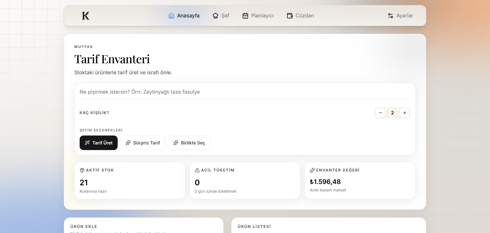
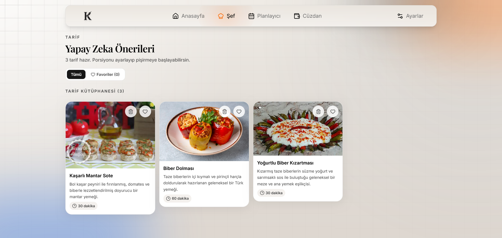
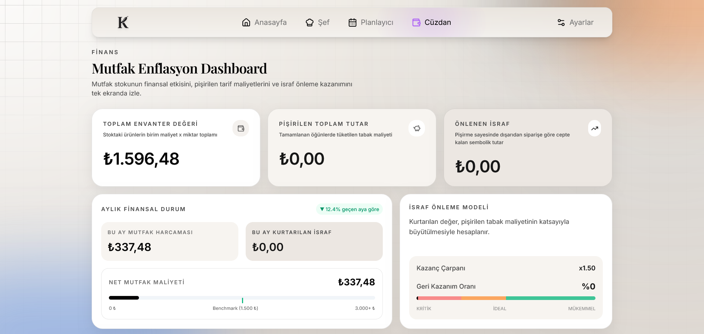
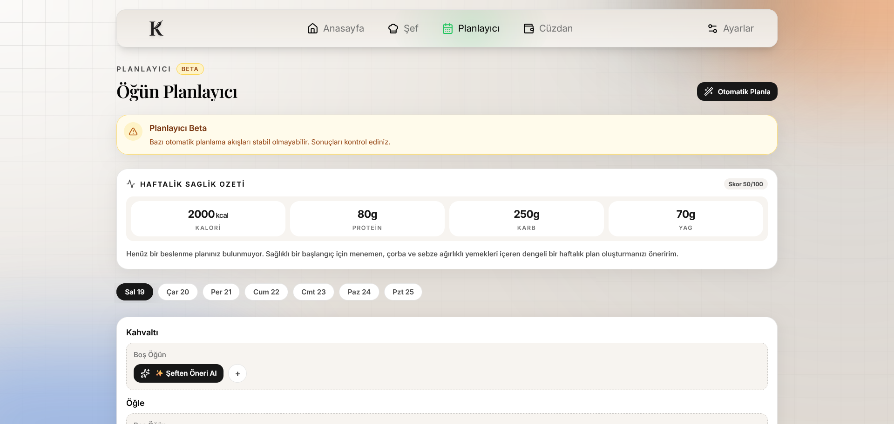
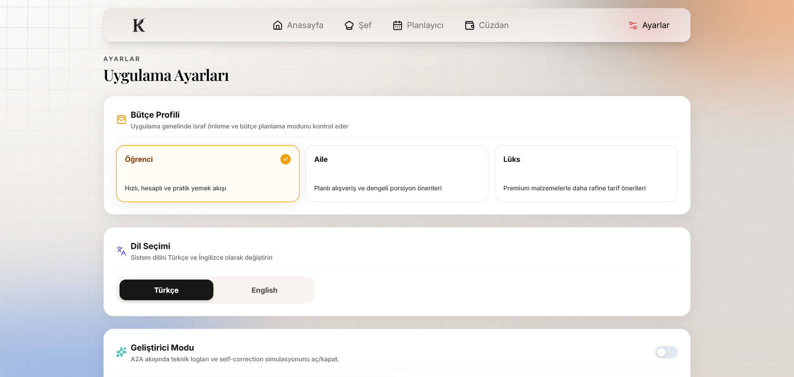

# 🌶️ Kapya - Akıllı Mutfak ve Finans Asistanı

> **BTK Akademi Hackathon 2026 Projesi** > Mutfak enflasyonuyla savaşan, israfı önleyen ve yapay zeka ajanlarıyla mutfağınızı finansal bir dashboard'a dönüştüren yeni nesil FoodTech & FinTech platformu.

🔗 **Canlı Demo:** [kapya-app.netlify.app](https://kapya-app.netlify.app/)

---

## 📱 Ekran Görüntüleri (Screenshots)

| 🏡 Ana Sayfa & Mutfak Stoğu | 🍳 Şef Sekmesi (AI Agent) | 💳 Cüzdan (Bento Financial Dashboard) |
| :---: | :---: | :---: |
|  |  |  |
| *Tarif Envanteri ve Kiler Yönetimi* | *Yapay Zeka Tarif Önerileri* | *Mutfak Enflasyon Dashboard* |
| **📅 Öğün Planlayıcı** | **⚙️ Ayarlar** | |
|  |  | |
| *Haftalık Öğün Planlama ve Sağlık Özeti* | *Bütçe Profili ve Uygulama Ayarları* | |


---

## 🌟 Öne Çıkan Özellikler

### 🎨 "Warm Canvas" Elit Tasarım Sistemi
Sıradan karanlık temaların veya boğucu aydınlık arayüzlerin ötesinde; şık krem, kum ve derin mürekkep tonlarıyla (`bg-canvas-sand`, `text-midnight-ink`) tasarlanmış, entelektüel ve premium bir SaaS arayüzü (Linear & Notion estetiği).

### 🤖 Akıllı Şef Motoru & "Agent Plan Loader"
Yapılan API isteklerinde kullanıcının sıkılmasını engellemek amacıyla arka plandaki LLM zincirinin adım adım ne düşündüğünü gösteren Framer Motion destekli dinamik yükleme arayüzü. 
* *Adım 1: Mutfak Envanteri Analiz Ediliyor...*
* *Adım 2: Maliyet ve Bütçe Hesaplanıyor...*
* *Adım 3: Sıfır İsraf Hedefli Tarif Üretiliyor...*

### 📊 Bento Box Stili Finansal Veri Paneli
Cüzdan sekmesinde mutfak harcamalarını, tüketilen tabak maliyetlerini ve otonom olarak hesaplanan **"Kurtarılan İsraf" (Prevented Waste)** metriklerini tek bir ekranda agregasyon motoruyla birleştiren modern grid yapısı.

### ⚡ Kolektif Önbellek (Semantic Cache) Mimarisi
Aynı malzeme kombinasyonuyla üretilen tarifleri **Upstash Serverless Redis** üzerinde global bir havuzda saklar. Aynı sorguyu atan farklı kullanıcılar LLM'e gitmeden milisaniyeler içinde ve sıfır API maliyetiyle cevaba ulaşır.

### 🌐 Tam PWA (Progressive Web App) Desteği
Vite PWA manifestosu entegrasyonu sayesinde uygulama mobil cihazlara ve masaüstüne yerel bir uygulama (standalone) gibi kurulabilir.

---

## 🛠️ Teknoloji Yığını (Tech Stack)

### Mimari Yapı
Uygulama, frontend ve backend katmanlarının tamamen izole edildiği modern bir **Monorepo** yapısına sahiptir.

* **Frontend (Netlify):** React, TypeScript, Vite, Tailwind CSS, Framer Motion, Swiper 3D Coverflow, Zustand (State Management), Lucide Icons, Shadcn/ui.
* **Backend (Render):** Node.js, Express.js, Google Gemini Pro API (Zod ile Strict JSON Schema validation), Upstash Serverless Redis (Önbellek Katmanı), CORS.

---

## Neden Kapya?

- Dolaptaki ürünleri ve tahmini son tüketim tarihlerini tek bir şık arayüzde takip etmeyi kolaylaştırır.
- Alışveriş fişi görselinden gıda ürünlerini otomatik olarak ayıklayıp mutfak envanterini günceller.
- Seçilen bütçe profiline göre kişiselleştirilmiş ve israfı azaltan yemek tarifleri üretir.
- Üretilen tarifleri öğle/akşam planlarına ekleyerek haftalık beslenme düzenini güçlendirir.
- LocalStorage tabanlı kalıcı veri saklama yaklaşımı sayesinde yüksek hızlı ve kesintisiz bir kullanıcı deneyimi sunar.

## Özellikler

### 1) Kiler (Pantry) Yönetimi ve Akıllı Fiş Entegrasyonu
- Ürün ekleme, güncelleme, akıllı miktar birleştirme ve silme işlemleri.
- Birim bazlı stok takibi: adet, gram, kilogram, paket, bağ, litre, mililitre.
- Tahmini raf ömrü bitiş tarihine göre "Acil Tüketim" ve "Aktif Stok" sınıflandırması.
- **Otomatik Finansal Senkronizasyon:** Fiş fotoğrafından başarıyla ayıklanan tüm ürünlerin parasal değerleri, anında mutfak envanter değerine (`Cüzdan` sekmesindeki harcamalara) otomatik olarak yansıtılır.

### 2) Fiş Analizi (AI Vision)
- Fiş görselini base64 veya veri URL'si formatında işleme.
- Görselin bir alışveriş fişi olup olmadığını yapay zeka ile otomatik doğrulama.
- Yalnızca yenilebilir gıda ürünlerini, miktarlarını ve birim fiyatlarını JSON formatında ayıklama.
- Hazır tüketime uygun ürünleri ve gıda dışı (temizlik, kozmetik vb.) kalemleri akıllıca filtreleme.

### 3) İsraf Azaltan Şef & Akıllı Tarif Ajanı
- Bütçe profili (Öğrenci, Aile, Lüks) + mevcut stok + acil tüketilmesi gereken ürünler girdisiyle çalışır.
- **Geleneksel Tarif İsimleri:** Yapay zeka tarafından oluşturulan tarif adları Türk mutfağına en uygun, sade ve yaygın isimler olacak şekilde optimize edilmiştir (örn: "Pirinç Pilavı", "Kuru Fasulye", "Menemen", "İzmir Köfte"). "Tava Sürprizi" gibi yapay isimler engellenmiştir.
- **Dinamik Porsiyon & Miktar Ölçekleme:** Tarif detay ekranından porsiyon sayısı değiştirildiğinde, tarifin malzeme miktarları (adet, gram vb.) formülsel olarak anında ve dinamik olarak güncellenir.
- **Yenisini Üret & Silme:** Beğenilmeyen bir tarif detay sayfasından "Yenisini Üret" seçeneğiyle kütüphaneden silinir ve arka planda mutfak stoğuna uygun, çakışmayan yepyeni bir alternatif tarif ajan tarafından canlandırılan cam yükleme ekranıyla birlikte üretilir.

### 4) Yemek Planlayıcı
- Üretilen tarifleri öğle/akşam olarak takvime ekleme.
- Öğün tamamlandığında stoktaki malzemelerin miktarlarını otomatik olarak düşme.
- Tamamlandı/tamamlanmadı durum takibi.

### 5) UX Katmanı ve Premium Arayüz
- **Mobil Öncelikli (Mobile-First) Premium Arayüz:** Modern glassmorphism kart tasarımları, pürüzsüz animasyonlar (`Framer Motion`) ve üst segment renk paletleri.
- **Yenilenen Kart Tabanlı Ayarlar:** Bütçe profilinizi, sistem dilini (TR/EN) ve geliştirici modunu kontrol edebileceğiniz şık kart tasarımları.
- **Zengin Demo Envanteri:** Test sürecini kolaylaştırmak amacıyla tek tıkla mutfak envanterini dolduran 15 adet kapsamlı Türk mutfağı temel malzemesi entegre edilmiştir.
- **Aydınlık Tema Kilidi (Enforce Light Mode):** Tasarımsal bütünlüğü korumak için karanlık tema geçici olarak devre dışı bırakılmış ve kararlı aydınlık temaya kilitlenmiştir.

## Mimari

Proje monorepo yapısındadır:

- **frontend:** React + Vite tabanlı mobil öncelikli istemci uygulaması.
- **backend:** Express tabanlı API ve yapay zeka katmanı.

Veri saklama yaklaşımı:

- **Frontend Uygulama Durumu:** LocalStorage (Zustand persist ile otomatik senkronizasyon).
- **Backend Geçici İşleme:** Bellek içi (in-memory) iş akışları.

## Teknoloji Yığını

### Frontend
- React 19
- Vite 8
- Tailwind CSS 3
- Zustand 5
- React Router 7
- i18next (Çoklu dil desteği)
- Framer Motion (Mikro etkileşimler ve animasyonlar)

### Backend
- Node.js + Express 5
- @google/genai (Resmi Gemini SDK)
- @langchain/google-genai
- dotenv
- cors

## Dizin Yapısı

```text
kapya-app/
  frontend/
    src/
      components/    # Ortak UI bileşenleri
      pages/         # Sayfa bileşenleri
      services/      # API istek yönetimleri
      store/         # Zustand durum yönetimleri
      utils/         # Yardımcı fonksiyonlar
  backend/
    src/
      controllers/   # İstek karşılayıcılar
      routes/        # API yönlendirmeleri
      services/      # Gemini API ve iş mantığı servisleri
      scripts/       # Yardımcı test araçları
```

## Gereksinimler

- Node.js 20 veya üzeri
- npm 10 veya üzeri
- Google Gemini API Anahtarı

## Kurulum

1. Depoyu yerel bilgisayarınıza klonlayın.
2. Gerekli bağımlılıkları yükleyin:

```bash
cd backend
npm install

cd ../frontend
npm install
```

## Ortam Değişkenleri

### backend/.env

```env
# API Ayarları
PORT=3001
GEMINI_API_KEY=api_anahtarinizi_buraya_yazin

# Opsiyonel Model Override Ayarları
GEMINI_MODEL=gemini-2.5-flash
GEMINI_VISION_MODEL=gemini-2.5-flash-lite
GEMINI_RECEIPT_CLASSIFIER_MODEL=gemini-2.5-flash-lite
GEMINI_TEXT_MODEL=gemini-3.1-flash-lite
GEMINI_IMAGE_MODEL=gemini-3.1-flash-image-preview

# Opsiyonel Harici Görsel Servisi
NANO_BANANA_API_URL=
NANO_BANANA_API_KEY=
```

### frontend/.env

```env
VITE_API_BASE_URL=https://kapya-app.onrender.com
```

## Geliştirme Modunda Çalıştırma

Aşağıdaki komutları ayrı terminal pencerelerinde çalıştırarak yerel sunucuları başlatın.

### Backend Sunucusu:

```bash
cd backend
npm run dev
```

### Frontend Sunucusu:

```bash
cd frontend
npm run dev
```

## Canlı Derleme (Production Build)

İstemci uygulaması derleme:

```bash
cd frontend
npm run build
```

Backend sunucusunu production modunda başlatma:

```bash
cd backend
npm start
```

## API Özeti

### Sağlık Kontrolü (Health Check)
- **Yöntem:** GET
- **Adres:** `/health`
- **Yanıt Örneği:**

```json
{ "status": "ok" }
```

### Fiş Analizi
- **Yöntem:** POST
- **Adres:** `/api/receipts/analyze`
- **İstek Gövdesi:**

```json
{
  "imageBase64": "data:image/jpeg;base64,..."
}
```

- **Başarılı Yanıt Örneği:**

```json
{
  "success": true,
  "data": [
    {
      "name": "Yumurta",
      "quantity": 15,
      "unit": "adet",
      "estimatedShelfLifeDays": 15
    }
  ]
}
```

### İsraf Önleyici Tarif Üretimi
- **Yöntem:** POST
- **Adres:** `/api/ai/recipes/waste-saver`
- **İstek Gövdesi:**

```json
{
  "budgetProfile": "öğrenci",
  "pantryStock": [
    {
      "name": "Yumurta",
      "quantity": 15,
      "unit": "adet",
      "estimatedShelfLifeEndDate": "2026-06-03"
    }
  ],
  "urgentProducts": [
    {
      "name": "Yumurta",
      "quantity": 15,
      "unit": "adet",
      "estimatedShelfLifeEndDate": "2026-06-03"
    }
  ],
  "agentInstruction": "Protein ağırlıklı seçenekler",
  "requestMode": "default"
}
```

- **Başarılı Yanıt Örneği:**

```json
{
  "success": true,
  "data": {
    "tarifler": [
      {
        "tarifAdi": "Menemen",
        "kisaAciklama": "Dolaptaki taze domates, biber ve yumurta ile hazırlanan geleneksel kahvaltı klasiği.",
        "tahminiSure": "15 dk",
        "goruntuUrl": "data:image/...",
        "matchedIngredients": [
          { "isim": "Yumurta", "miktar": "3", "birim": "adet" }
        ],
        "missingIngredients": [
          { "isim": "Domates", "miktar": "2", "birim": "adet" }
        ],
        "pisirmeAdimlari": [
          "Biberleri ve domatesleri soteleyin.",
          "Yumurtaları ekleyip karıştırın."
        ]
      }
    ]
  }
}
```

## Duman Testi (Smoke Test)

Backend uç noktalarını doğrulamak için otomatik duman testini çalıştırabilirsiniz:

```bash
cd backend
npm run test:smoke
```

## Kod Kalitesi ve İlkeler

- **SRP (Tek Sorumluluk Prensibi):** Görünüm katmanı (UI) ile iş mantığı (business logic) kesin olarak ayrılmıştır.
- **Katmanlı Mimari:** İstek karşılayıcılar (controllers) sadece yönlendirme ve HTTP katmanını yönetirken, yapay zeka ve stok algoritmaları bağımsız servis dosyalarında işlenir.
- **Hata Yönetimi:** Tüm operasyonel hatalar frontend ve backend katmanlarında yakalanarak kullanıcı dostu toast bildirimlerine dönüştürülür.

## Lisans

Copyright (c) 2026 REG. Tüm hakları saklıdır. Bu projenin kaynak kodları yalnızca BTK Akademi Hackathon 2026 değerlendirme süreci için incelemeye açılmıştır. Kaynak kodların veya projenin kopyalanması, çoğaltılması veya ticari amaçlarla kullanılması kesinlikle yasaktır.
